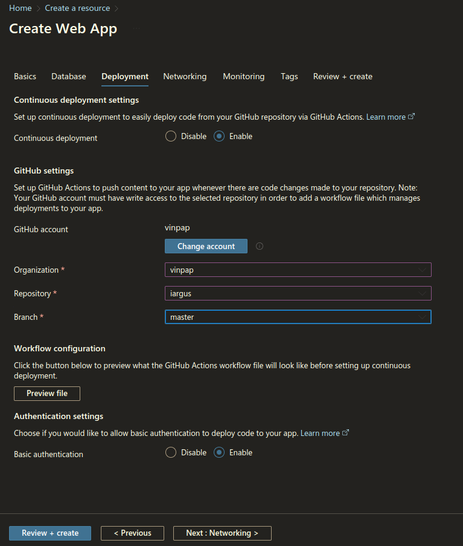
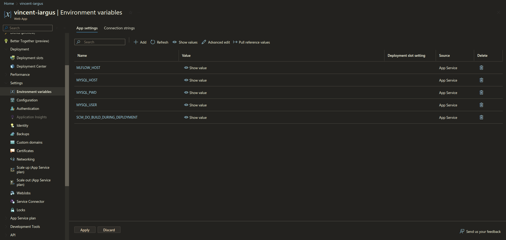
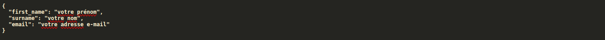
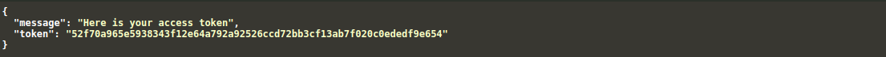
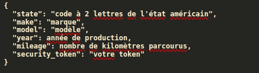

# IArgus

Cette documentation détaille comment mettre en place l'API d'IArgus avec tous les composants nécessaires à son fonctionnement.

Prérequis :
- Git
- Python et Pip

Avant toute chose, "forkez" ce dépôt en cliquant sur l'icône "Fork" en haut à droite de l'écran.
## Installation de la base de données MySQL

Pour commencer, mettons en place le serveur MySQL nécessaire à l'API et au script de monitorage du modèle d'intelligence artificielle. Ce serveur compte deux bases de données qui stockent respectivement :
- les tokens générés par l'API, ainsi que les identifiants des utilisateurs pour qui ces tokens ont été générés
- les données de ventes de voiture utilisés pour effectuer le monitorage.

Vous pouvez installer MySQL sur une machine dédiée et l'utiliser comme serveur, ou faire appel à un fournisseur de cloud pour héberger votre base de données. Pour simplifier la mise en place des bases de données, il vous suffit d'exécuter le script "db_creation.sql" présent dans ce dépôt sur votre serveur en utilisant la commande ```mysql -h <hôte de votre serveur MySQL> -u <votre nom d'utilisateur> < db_creation.sql``` en vous plaçant dans le dossier du dépôt Git.

## Lancement de MLflow

Plusieurs solutions sont disponibles pour héberger MLflow. Vous pouvez :
- Héberger MLflow sur une machine dédiée et rendre votre serveur public. Pour cela, exécutez ces commandes :
```
pip install mlflow
mlflow server --host <adresse IP de la machine où vous vous trouvez> 
```

**Attention** : cette méthode n'est pas sécurisée. Ainsi, n'importe qui peut utiliser votre serveur sans votre permission s'il connaît votre adresse IP ! Pensez à définir une whitelist d'adresse IP autorisées à envoyer des requêtes à votre serveur si vous choisissez cette solution.
- Héberger MLflow en faisant appel à un fournisseur de services de cloud. Plus sécurisée, cette solution est préférable à la solution mentionnée ci-dessus. Rapprochez-vous d'un service d'hébergement comme Microsoft Azure ou Databricks pour consulter leurs tarifs si vous préférez cette solution.

## Déploiement de l'API

Cette section vous montre comment déployer l'API IArgus sur le service Web App proposé par Microsoft Azure. Tout d'abord, supprimez le dossier ".github" du dépôt que vous avez forké puis créez un nouveau dépôt sur GitHub et poussez-y le vôtre.

Il vous faut maintenant créer une ressource Microsoft Web App sur Azure (notez que vous aurez besoin d'un abonnement pour cela). [Ce tutoriel](https://www.scholarhat.com/tutorial/azure/creating-web-app-tutorial-pricing) explique la marche à suivre. **Attention** : pendant la création de votre ressource, à l'étape "déploiement", activez le déploiement continu en renseignant votre compte GitHub ainsi que les imformations concernant le dépôt où vous avez poussé IArgus comme le montre la capture d'écran ci-dessous.




Ceci activera le déploiement continu pour IArgus. Validez ensuite la création de l'application.

Vous remarquerez qu'un dossier .github a automatiquement été créé dans votre dépôt. Ouvrez le fichier YAML présent dans le dossier ./github/workflows. Remplacez la section "on" au début du fichier par ceci :
```
on:
  push:
    branches:
      - "master"
  pull_request:
    branches:
      - "master"
  workflow_dispatch:

env: 
  MYSQL_HOST: ${{ secrets.MYSQL_HOST }}
  MYSQL_PWD: ${{ secrets.MYSQL_PWD }}
  MYSQL_USER: ${{ secrets.MYSQL_USER }}
  MLFLOW_HOST: ${{ secrets.MLFLOW_HOST }}
```

Remplacez "master" par le nom de la branche d'où est déployé votre application si nécessaire. La section "env" définit des variables d'environnement nécessaires à l'exécution des tests d'IArgus. Remarquez que leurs valeurs n'apparaissent pas dans le fichier : il faut les définir en tant que secrets via l'interface de GitHub. Rendez-vous donc dans les paramètres de votre dépôt et définissez les secrets suivants :
- MYSQL_HOST : l'adresse de la base de données
- MYSQL_PWD : le mot de passe de votre base de données
- MYSQL_USER : votre nom d'utilisateur sur votre serveur MySQL
- MLFLOW_HOST : L'adresse IP du serveur où vous avez exécuté MLflow.


Ces variables d'environnement doivent aussi être définies dans l'environnement de votre ressource sur Azure. Sur la page de votre ressource, cliquez sur "Paramètres" à gauche puis rendez-vous dans la section "Variables d'environnement". Sur l'écran qui apparaît, créez quatre variables d'environnement qui portent le même nom et ont les mêmes valeurs que les quatre variables définies plus haut. Votre écran devrait ressembler à ceci :



Enfin, avant la section "build" dans le fichier YAML, insérez ce code :
```
test:
    runs-on: ubuntu-latest

    strategy:
      matrix:
        # Run in all these versions of Python
        python-version: [3.8, 3.9]
    steps:
        # Setup which version of Python to use
      - name: Checkout repository files
        uses: actions/checkout@v2
      - name: Set Up Python ${{ matrix.python-version }}
        uses: actions/setup-python@v2
        with:
          python-version: ${{ matrix.python-version }}

        # Display the Python version being used
      - name: Display Python version
        run: python -c "import sys; print(sys.version)"

        # Install pytest
      - name: Install pytest and dependencies
        run: |
          python -m pip install --upgrade pip
          pip install pipenv
          pipenv install
        # Run the tests
      - name: Run tests
        run: |
          pipenv run mlflow server --host 127.0.0.1 --port 8080 & pipenv run python setup_tests.py
          pipenv run python -m pytest
```

Ceci permettra aux tests d'IArgus d'être exécutés à chaque fois que vous pousserez ou fusionnerez du code sur la branche spécifiée au début du fichier. Vous pouvez maintenant pousser votre code sur GitHub pour appliquer les changements.

La dernière étape consiste à spécifier sur Azure la commande qui doit être exécutée pour lancer l'application. Sur la page de votre ressource, cliquez sur "Configuration" et entrez la commande suivante dans le champ "Commande de démarrage" : ```gunicorn -w 4 -k uvicorn.workers.UvicornWorker api:app```. Votre API est maintenant opérationnelle.

**Attention** : le certificat de sécurité joint à cette API a été généré par mes soins. Si vous utilisez un certificat plus sécurisé, vous devez remplacer les valeurs ssl_certificate_path et ssl_key_path dans config.yml pour utiliser votre certificat à la place.

## Mise en place du monitorage

Le script qui effectue le monitorage de l'intelligence artificielle est model_monitoring.py. Ce script est pensé pour être exécuté une fois par mois. Vous pouvez utiliser un service tel qu'Azure Function pour automatiser son exécution, en spécifiant un intervalle d'exécution de un mois.

Pour fonctionner, ce script a besoin d'un serveur SMTP ainsi que d'informations concernant la personne à qui envoyer des alertes par e-mail en cas de déclin des performances du modèle. Sur la machine qui doit exécuter le script de monitorage, copiez les fichiers suivants :
- config.yml
- features_encoder.pkl
- model_monitoring.py
- requirements.txt

Puis exécutez ces commandes :
```
    export SMTP_LOGIN=<votre identifiant sur le serveur SMTP>
    export SMTP_RECIPIENT=<l'adresse où envoyer les alertes>
    export SMTP_PWD=<votre mot de passe sur le serveur SMTP>
    export SMTP_SERVER=<l'adresse du serveur SMTP>
    export MLFLOW_HOST=<adresse de votre serveur MLflow>
    pip install -r requirements.txt
```

Votre script de monitorage est maintenant fonctionnel.


## Intégration à une application existante

Pour utiliser l'API, vous devez préalablement obtenir un token. Pour cela, envoyez une requête POST à l'adresse <URL de votre ressource Azure>/get_token en joignant ces informations au corps de la requête :



Vous recevrez le token de sécurité comme ceci :



Ce token **valable 180 jours uniquement** est obligatoire pour utiliser le endpoint /predict qui vous permet de prédire le prix de vente d'une voiture d'occasion aux États-Unis. Pour utiliser ce endpoint, envoyez-lui une requête POST avec les informations suivantes dans le corps de la requête :



Le prix prédit pour votre voiture sera la valeur "predicted_price" dans les données renvoyées en format JSON.


